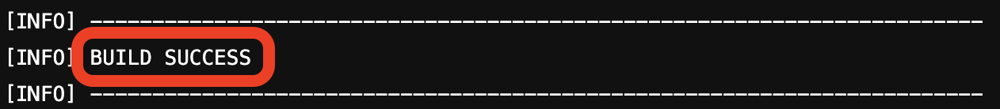
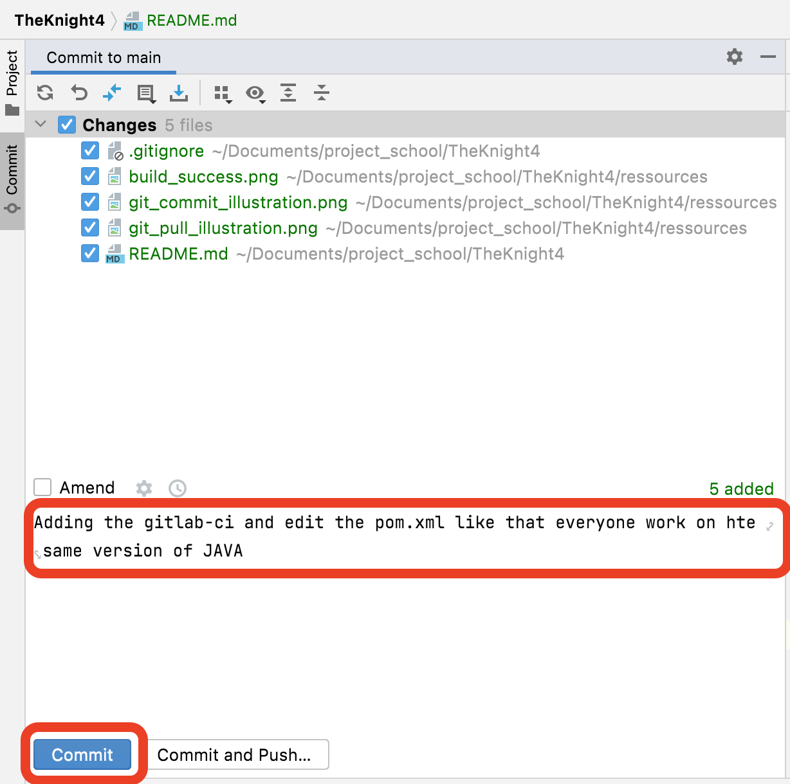

# ⚠️ If you cannot launch the project

- Leave intellij
- Delete the .idea and the .mvn folder
- Launch again intellj


# Project The Knight

Goal is to create a tower defence game in Java

# How to manage GitLab

Steps for managing Gitlab

### How to commit on GitLab

- #### Step 1 :
Code : 
```
git add .
git pull
```
Or in IntelliJ


=> If merge trouble, correct / adapt your code
- #### Step 2 : 
```
mvn clean
mvn package
mvn test
```

If the build fail, please correct the problems



- #### Step 3 : commit with your message
Code :
```
git commit -m "Your message"
```
Or in intellij




- #### Step 4 : push your commit
```
git push
```

Or in intellij

